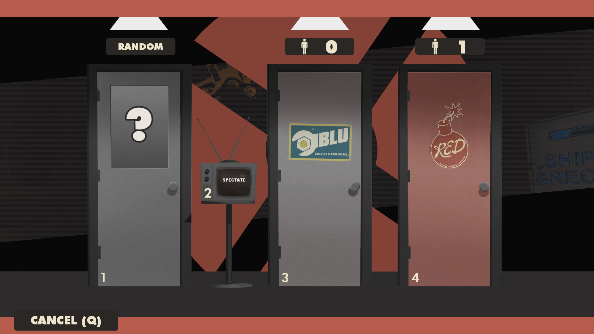
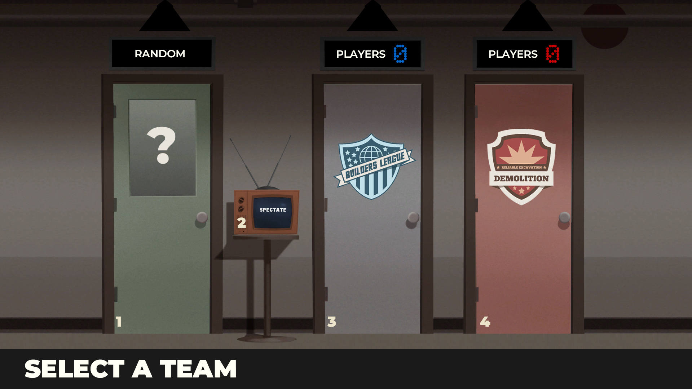

# VGUI Menu Models

> This same setup is used in (currently in development branch of) [SolarLightHUD Redux's](https://github.com/SolarLightTF2/solarlighthud-redux/tree/team-class-select-revamp) team menu.

*_SolarLightHUD Redux_*

*_PASS Fortress HUD_*

# Why?

By default, these models take the textures from materials/vgui/models, which while you can change out by creating those folders and adding the textures you want in there, will not work on sv_pure 1 or 2 servers, for whatever reason. The models provided here use the textures from vgui/replay/thumbnails/models, with the directory vgui/replay/thumbnails being whitelisted by Valve, it allows for the textures to be loaded on all servers, no matter the sv_pure value.

# Implementation in your custom HUD

Let's say you want to get the class selection model in your HUD, you need to download the source of the repository, open the folder <ins>ui_class01</ins>, and drop the sub-folder named models inside of your HUD's root directory (where info.vdf is located)

Upon loading into the game, your class selection screen will be a missing texture mess, that is because you need to add the textures, simply go to materials/vgui/replay/thumbnails (if you dont have those folders, simply create them) and create a folder called models inside of it, put the VTFs and VMTs that you need and restart TF2/run sv_cheats 1;mat_reloadallmaterials in console, if you did everything correctly, it should use the textures you provided and work properly for everyone, on every server

### Side note, versus_doors_win have 2 directories from where they take the texture files, thumbnails/models and thumbnails/models/props_ui

In theory, this can also be used to load fully custom models, for example, to replace the round sign model with a fully custom one, complete with a custom animation

I've added the [decompiled assets](https://github.com/SashaLegush/tf2-hud-menu-models/tree/main/decompiled) along with the [textures](https://github.com/SashaLegush/tf2-hud-menu-models/tree/main/textures) to the models as .pngs to the repository, if you are interested in making custom models for tf2/compiling more models (casual and competitive badges), take a look there!
